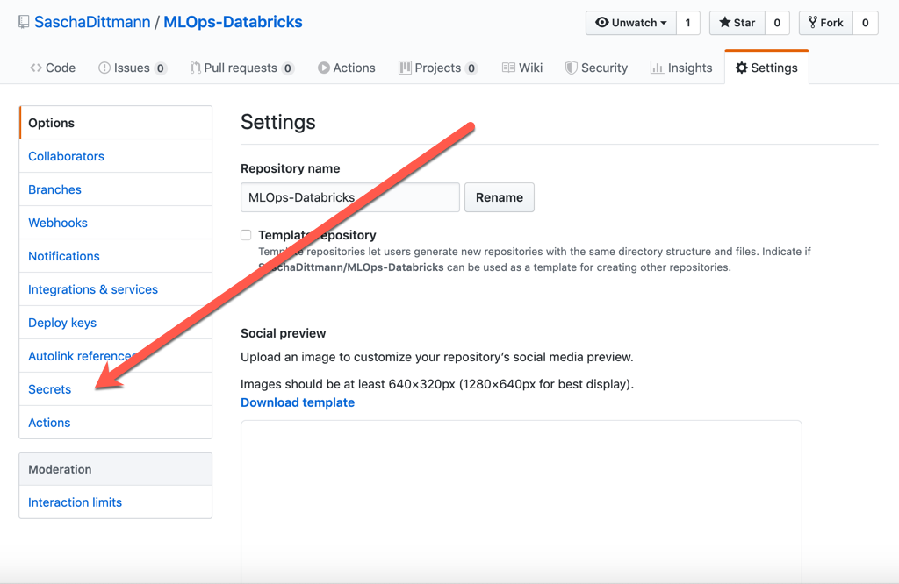

# MLOps with AzureML & Databricks for Real Time Inference
## How to implement MLOps using Azure Devops, Databricks, MLFlow, Azure ML


This repo implements MLOPs for large-scale  Machine Learning operaltionalization using [Azure Databricks](https://azure.microsoft.com/en-us/services/databricks/), [MLFlow](http://mlflow.org), [AzureML](https://azure.microsoft.com/en-us/services/machine-learning/), [Azure Container Services](https://azure.microsoft.com/en-us/product-categories/containers/) and [Azure Kubernetes Services](https://azure.microsoft.com/en-us/services/kubernetes-service/). The sample architecture adopted in this project is pictured below:


## Real-time Inference

This repo is configured to serve real-time model inference. Real-time or online inference enables low-latency scoring with immediate prediction outputs. The model is exposed via a REST API, deployed as a managed web server on a docker container (dev/test environment) of Azure kubernetes cluster (production). 

# How to deploy this project 

## Required Resources & pre-configuration steps 

You will need the following resources to get started:

### Azure Databricks Workspace

In your Azure subsciption,  [create an Azure Databricks workspace](https://docs.azuredatabricks.net/getting-started/try-databricks.html#step-2-create-a-databricks-workspace).

## Import This DevOps Project

In Azure DevOps,  [create a project](https://docs.microsoft.com/en-us/azure/devops/user-guide/sign-up-invite-teammates?view=azure-devops#create-a-project) to host your MLOps pipeline.


### Connect Azure Databricks Notebooks to the Azure DevOps Repo

Connect your notebooks to the Azure DevOps repo. To configure this, go to the "User Settings" and click on "Git Integration". 

### Create MLFlow Experiment
Create the MLFlow experiment  in the Databricks workspace.


### Create SPN 

## Set up The Build Pipeline

By importing the GitHub files, you also imported the [azure-pipelines.yml](./azure-pipelines.yml) file.

This file can be used to create your first Build Pipeline.

This Build Pipeline is using a feature called "[Multi-Stage Pipelines](https://docs.microsoft.com/en-us/azure/devops/pipelines/process/stages?view=azure-devops&tabs=yaml)". This feature might not be enabled for you, so in order to use it, you should [enable this preview feature](https://docs.microsoft.com/en-us/azure/devops/project/navigation/preview-features?view=azure-devops).


## Connecting Azure Databricks

### Connecting the Azure DevOps *pipeline* to Azure Databricks

To be able to run this pipeline, you also need to connect your Azure Databricks Workspace with the pipeline.

Therefore, yor first need to [generate an access token on Databricks](https://docs.azuredatabricks.net/dev-tools/api/latest/authentication.html#generate-a-token).

This token must be stored as encrypted secret in your Azure DevOps Build Pipeline...


> NOTE: The variable must be called *databricks.token* as it is referenced within the pipeline YAML file.
> NOTE: There are additional variables that need to be defined to ease the build & deployment operation. You're free to decide if those variables should be defined as secrets or text values.


... or your GitHub Project.



> NOTE: The GitHub Secret must be called *DATABRICKS_TOKEN*


## Connecting the Azure ML Service Workspace

### Step 1: Create Azure AD Service Principal

The Databricks-Notebooks will be used also for serving your model, by leveraging and creating an Azure Machine Learning Workspace (and other resources) for you.

Azure Databricks Service requires access rights to do that, therefore you need to create a Service Principal in your Azure Active Directory.

You can do that directly in the [Cloud Shell](https://docs.microsoft.com/en-us/azure/cloud-shell/overview) of the Azure Portal, by using one these two commands:

``` bash
az ad sp create-for-rbac -n "http://MLOps-Databricks"
```

> Least Privilege Principle: If you want to narrow that down to a specific Resource Group and Azure Role, use the following command

``` bash
az ad sp create-for-rbac -n "http://MLOps-Databricks" --role contributor --scopes /subscriptions/{SubID}/resourceGroups/{ResourceGroup1}
```

> Make a note of the result of this command, as you will need it in a later step.


_Disclaimer:_ This work is inspired by and based on efforts done by Sascha Dittman & Ahmed Mostafa.
