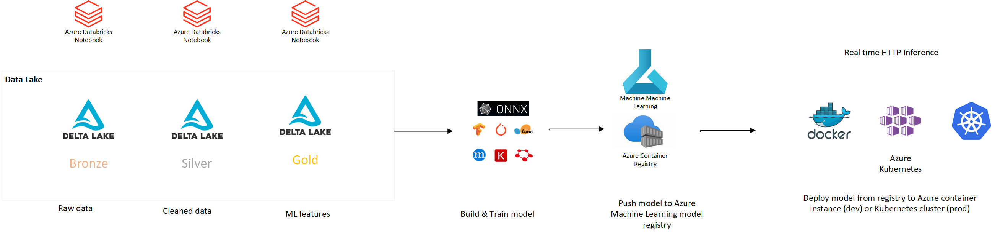
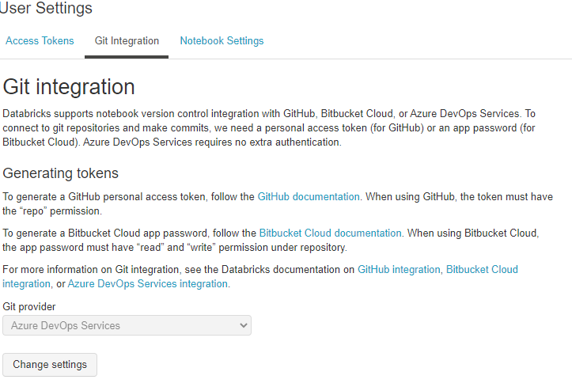
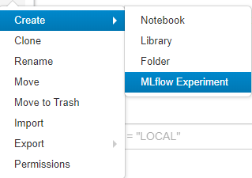
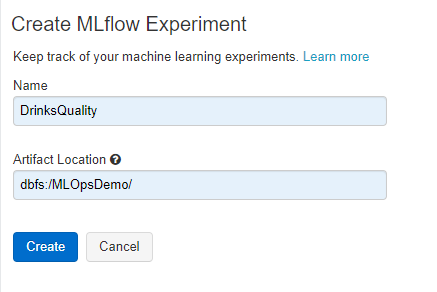
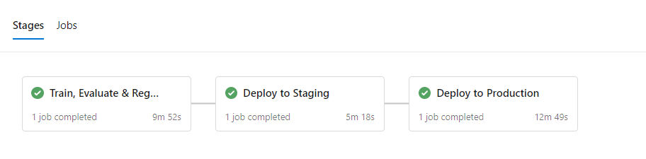
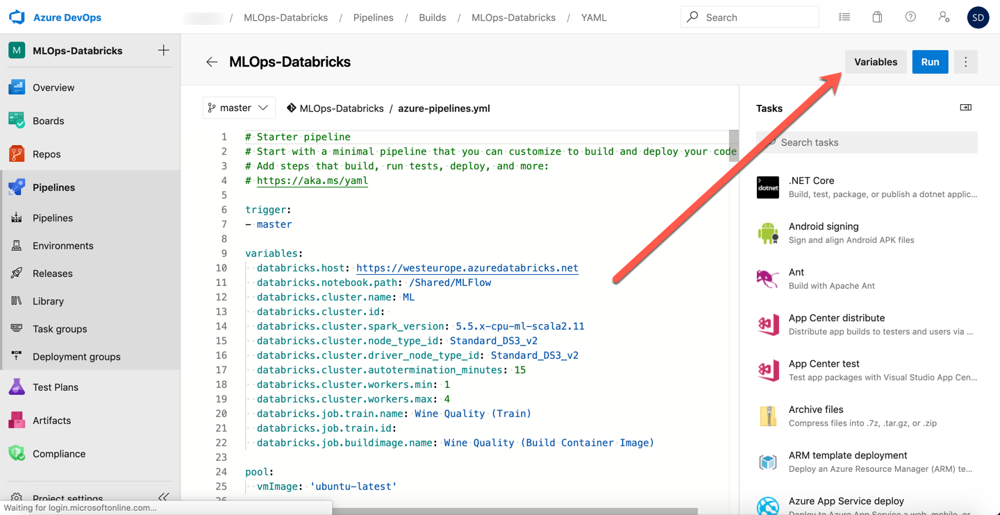
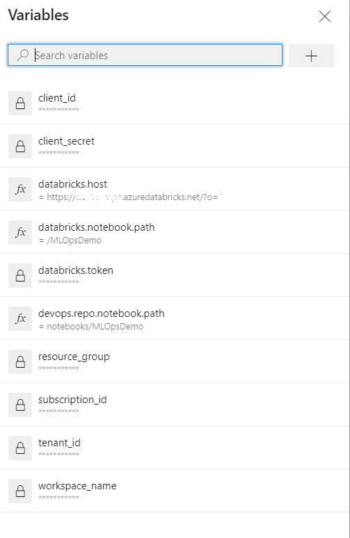
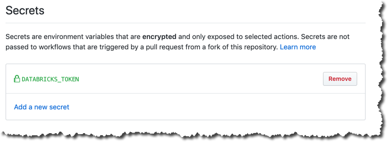

# MLOps with AzureML & Databricks for Real Time Inference
## How to implement MLOps using Azure Devops, Databricks, MLFlow, Azure ML

This repo implements MLOPs for large-scale  Machine Learning operaltionalization using [Azure Databricks](https://azure.microsoft.com/en-us/services/databricks/), [MLFlow](http://mlflow.org), [AzureML](https://azure.microsoft.com/en-us/services/machine-learning/), [Azure Container Services](https://azure.microsoft.com/en-us/product-categories/containers/) and [Azure Kubernetes Services](https://azure.microsoft.com/en-us/services/kubernetes-service/). The sample architecture adopted in this project is pictured below:

## Real-time Inference

This repo is configured to serve real-time model inference. Real-time or online inference enables low-latency scoring with immediate prediction outputs. The model is exposed via a REST API, deployed as a managed web server on a Azure container instance (dev/test environment) of Azure kubernetes cluster (production). 

# How to deploy this project 

You will need the following resources to get started:

## Azure Databricks Workspace

In your Azure subsciption,  [create an Azure Databricks workspace](https://docs.azuredatabricks.net/getting-started/try-databricks.html#step-2-create-a-databricks-workspace) on its own resource group.

## Azure Machine Learning Workspace

In your Azure subscription, [create an Azure Machine Learning workspace](https://docs.microsoft.com/en-us/azure/machine-learning/quickstart-create-resources#create-the-workspace) on its own resource group. No need to add compute.

## Import This DevOps Project

In Azure DevOps,  [create a project](https://docs.microsoft.com/en-us/azure/devops/user-guide/sign-up-invite-teammates?view=azure-devops#create-a-project) to host your MLOps pipeline. Import the code to your DevOps repo.

## Connect Azure Databricks Notebooks to the Azure DevOps Repo

Connect your notebooks to the Azure DevOps repo. To configure this, go to the "User Settings" and click on "Git Integration". 

## Create an MLFlow Experiment
Create the MLFlow experiment  in the Databricks workspace.

## Create SPN 

Create a  [Service Principal](https://docs.microsoft.com/en-us/azure/active-directory/develop/howto-create-service-principal-portal#register-an-application-with-azure-ad-and-create-a-service-principal) in your Azure Active Directory and give it contributor permissions to the resource group where your Azure Machine Learning workspace is deployed. 

## Set up The Build Pipeline

Use the  [azure-pipelines.yml](./azure-pipelines.yml) file to create your  Build Pipeline.

This Build Pipeline is using  "[Multi-Stage Pipelines](https://docs.microsoft.com/en-us/azure/devops/pipelines/process/stages?view=azure-devops&tabs=yaml)".  [Enable this feature](https://docs.microsoft.com/en-us/azure/devops/project/navigation/preview-features?view=azure-devops). The staging setp is deploying the model to an Azure Container instance for dev/test purposes. The final step is promoting the model to Azure Kubernetes deployment representing the final production stage. 

## Setup your secrets and variables

 To connect your Azure Databricks Workspace with the Build pipeline you  need to [generate an access token on Databricks](https://docs.azuredatabricks.net/dev-tools/api/latest/authentication.html#generate-a-token).

This token must be stored as encrypted secret named  *databricks.token* in your Azure DevOps Build Pipeline.

List of Pipeline Variables required:
* clinet_id: The SPN clinet id
* clinet_secret: The SPN secret
*  tenant_id: The SPN tenant id
*  subscription_id: your subscription id
*  workspace_location: the region used to deploy your Azure Machine Learning workspace
*  workspace_name: your Azure Machine Learning workspace name
*  resource_group: your Azure Machie Leatning resource group
*  databricks.notebook.path: Notebook path in the Databricks workspace
*  devops.repo.notebook.path: Notebook path in the DevOps repo
*  databricks.token

Note the variable section in  the  [azure-pipelines.yml](./azure-pipelines.yml) file. Ensure you set the *databricks.host* to your Databricks Workspace url. 

_Disclaimer:_ This work is inspired by and based on efforts done by Sascha Dittman & Ahmed Mostafa.
